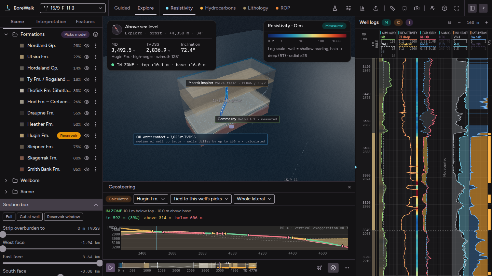
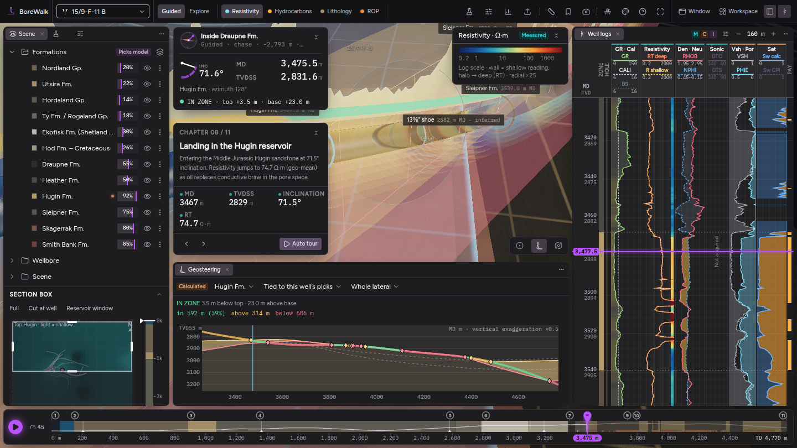
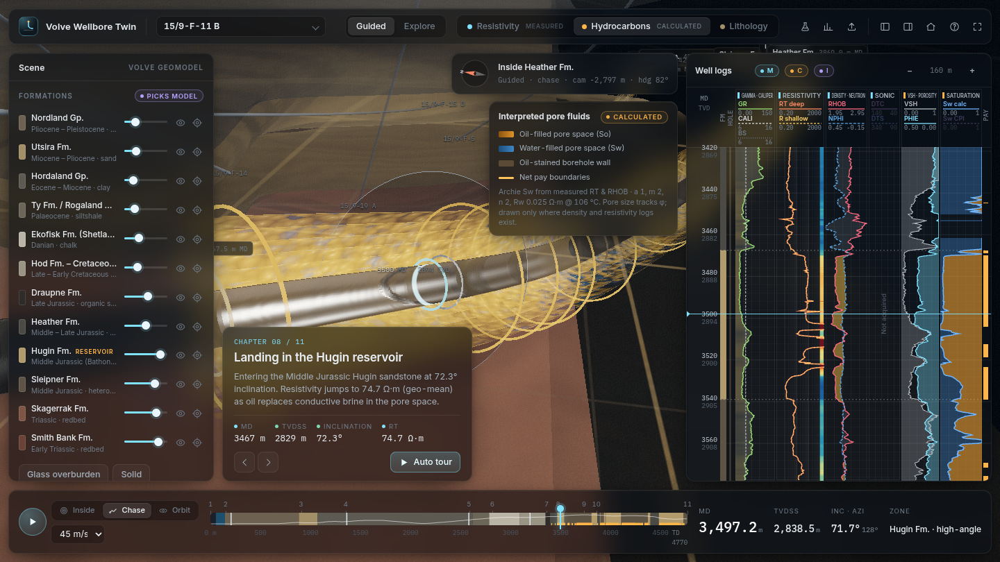
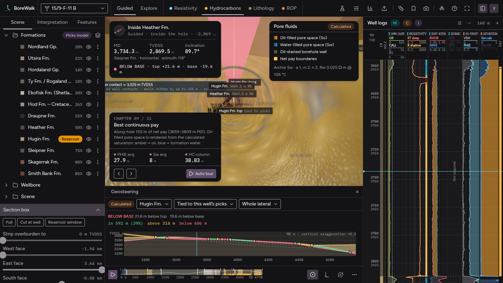

# BoreWalk

BoreWalk is a web-based 3D wellbore visualization that works like an architectural walkthrough, built on real public oil and gas data from Equinor's **Volve** field (North Sea, block 15/9). You can travel from the drill floor through the water column, the cased vertical hole, the build section and the near-horizontal lateral of well **15/9-F-11 B**. Along the way you see the borehole geometry from the caliper log, the inferred casing strings, formation tops, bedding, fractures and the Hugin oil reservoir. You can also fly freely around a structural geomodel built from 34 wellbores.

The interface is built with [Tecton UI](#user-interface-tecton), the `@tecton/react` component library (shadcn/ui on React Aria, with the Tecton theme), around a three.js engine.

| Field overview | Landing in the reservoir (measured resistivity) |
| --- | --- |
|  |  |
| **Interpreted hydrocarbons (calculated)** | **Inside the borehole** |
|  |  |

> The screenshots were rendered with a software GPU in headless Chromium (`?q=low`: no MSAA and no bloom). On a real GPU the app renders with MSAA, bloom and adaptive resolution.

## Running the app

### Prerequisites

- **Node.js 22 or newer**
- **pnpm 10**. The exact version is pinned in `package.json` (`packageManager`). The easiest way to get it is `corepack enable`, which ships with Node. Alternatively run `npm install -g pnpm`.
- A browser with **WebGL 2** and hardware acceleration enabled (current Chrome, Edge, Firefox or Safari).

### 1. Install

```bash
git clone https://github.com/rpkapps/wellbore-architecture-like-walkthrough.git
cd wellbore-architecture-like-walkthrough
corepack enable        # once per machine, activates the pinned pnpm
pnpm install
```

### 2. Start the development server

```bash
pnpm dev
```

Open http://localhost:5173. The app loads the preloaded Volve dataset (about 16 MB of LAS, survey, picks and production files) and then flies to the field overview. Code changes hot-reload.

To open it from another device on your network (a tablet or a meeting-room screen, for example), run `pnpm dev --host` and use the network URL it prints.

### 3. Build and serve a production version

```bash
pnpm build             # type-checks, then writes the static site to dist/
pnpm preview           # serves dist/ at http://localhost:4173
```

`dist/` is a fully static site that uses relative paths, so any static host works: GitHub Pages, Netlify, S3, nginx, or a sub-folder of an existing site. It has to be served over HTTP, because opening `dist/index.html` straight from disk (`file://`) blocks the data requests. For a quick local check without Node:

```bash
cd dist && python3 -m http.server 8080    # http://localhost:8080
```

### URL options

| Option | Effect |
| --- | --- |
| `?q=low` | Performance mode: pixel ratio 1, no MSAA, no bloom. Use it on integrated or older GPUs, remote desktops and VMs. |

Even without it, the app lowers its render resolution automatically when the frame rate drops.

### User interface (Tecton)

Everything around the 3D view is React with [`@tecton/react`](https://github.com/rpkapps/tecton-ui-1): dialogs, sheets, menus, tabs, tables and charts are Tecton components themed by its dark token set (Figtree and IBM Plex Mono). The 3D scene and the canvas-drawn plots (log tracks, strips, crossplots, maps) keep their own renderers and take their chrome colours and fonts from the Tecton tokens.

**Workspace.** The 3D view fills the window and never changes size; the panels float over it, Illustrator style (`src/ui/workspace/`). Scene, Properties, Interpretation, Features, Well logs and every tool window are panels in tabbed groups on three dock columns (left, right, bottom) or in floating windows. Drag a tab to another group, above or below one to split it, to an empty window edge to start a column, or onto the view to float it; drag column edges and splits to resize; fold a column to a strip of icons whose panels open as flyouts. The panel menu (⋯) docks and floats from the keyboard, **Window** shows and hides panels, **Workspace** switches between layouts for a task (Walkthrough, Petrophysics, Geosteering) and your own named workspaces (save, update, rename, delete), and **Tab** (with nothing focused) hides every panel. A column can be dragged wide enough to fill the window. The projection centre follows the area the panels leave free, so the subject stays centred without resizing the canvas. Docking, folding and hiding panels, and the position, key, details and chapter cards collapsing to one-line chips, animate with React's `<ViewTransition>` (the frosted glass of translucent panels is carried by the moving box, so it never drops out mid-animation). Dragging a window or a column edge moves the DOM directly and renders nothing until you let go.

**Selection and Properties.** Clicking an object in the 3D view or a row of the Scene tree selects it (`app.selection`: a well, formation, pick, contact, overlay or interval; Escape clears it). The tree highlights the selected row and gains a *Wells* folder; the **Properties** panel (under the Scene group by default) shows the selected object's details with provenance, a filter for them, and its settings: a formation's colour, visibility, opacity and isolation, a scene layer's visibility, an overlay feature's own settings. Its pin keeps it on one object while you select others, to compare them. While Properties is closed or hidden, the floating details card over the 3D view shows the selection instead. Right-click a tree row or an object in the 3D view (or use a row's ⋮) for its actions: they come from the action registry, where each action names the kinds of object it applies to (`appliesTo`).

**Controls and look.** Numbers are scrub fields (drag sideways, click to type, arrow keys); the net-pay cut-offs and GR limits draw the well's own distribution inside the field. Text uses a small set of roles (titles, section headers, labels, values, captions) at a 14 px root size; the accent colour marks only what must stand out (cursor, playhead, selection). The **Personalise** dialog (palette button) sets the theme (dark, light or system), density, accent colour, panel opacity and background blur, whether overlays start collapsed, scene-label density and reduced motion; settings are kept in the browser. The resistivity colour map is chosen from the colour key itself: each map is previewed over the active well's own deep-resistivity log, and hovering one previews it live. Folders in the Scene tree, feature groups and the track list have a switch for everything in them; truncated text shows in full on hover. The 3D view draws on demand (camera motion, input, state changes) rather than every frame, and the page loader animates in a worker (OffscreenCanvas) so it keeps moving while the dataset is parsed.

**Actions and the command palette.** Every operation is an action (`src/actions/`): an id that doubles as a tool name, a title, a description, a Zod input schema, and whether it needs approval. The command palette (**⌘K / Ctrl K**, or the search button) lists them, drills into their choices (every well, formation, feature, workspace) and asks for values (go to depth, set a parameter); keys such as Space, V, N / P and 1–3 run the same actions. The registry validates input and returns errors as values, `app.actions.describe()` gives JSON Schema tool descriptions, and `src/actions/tanstack.ts` turns the actions into TanStack AI client tools, so an assistant added later calls exactly what the palette does (read-only `app.state` tells it what is on screen and what is selected). An action with `appliesTo` also appears in the right-click menus: `app.actions.actionsFor(selection)` lists the ones that apply to the selected object with its id filled in (by convention as `{ formation: id }`, `{ well: id }`, or mapped by the action's `onSelection`).

`@tecton/react` is a private package, so it is vendored as a packed tarball in `vendor/` and installed from there (`"@tecton/react": "file:vendor/tecton-react-0.1.0.tgz"`). To update it, pack it in the Tecton repository and replace the tarball:

```bash
# in a checkout of rpkapps/tecton-ui-1
pnpm install
pnpm --filter @tecton/react pack --pack-destination /path/to/borewalk/vendor
# back in this repository
pnpm install
```

When the version number changes, update the file name in `package.json` too. The package ships its usage guidelines as a command: `pnpm exec tecton search "<what the UI must do>"` finds a component and `pnpm exec tecton docs <id>` prints how to use it.

### Tests and checks

```bash
pnpm test              # unit tests against the real Volve files (parsers, min-curvature, CPI calibration, zonation),
                       # the connector codecs and steps, and the relay against fake Kafka, WITSML, ETP, OSDU, TCP and MQTT servers
pnpm typecheck         # TypeScript only
```

### Regenerating the preloaded dataset (optional)

The prepared files are committed in `public/data/volve/`, so you only need this step to rebuild them from the upstream sources. It needs Python 3 with `numpy`, `pandas` and `openpyxl`, plus shallow clones of the public source repositories under the folder names the script expects:

```bash
pip install numpy pandas openpyxl
mkdir -p ~/volve-src && cd ~/volve-src
git clone --depth 1 https://github.com/andymcdgeo/Petrophysics-Python-Series pps
git clone --depth 1 https://github.com/yohanesnuwara/volve-machine-learning volve-machine-learning
git clone --depth 1 https://github.com/orkahub/PEG_Python peg
git clone --depth 1 https://github.com/jczettl/wellbore-trajectory-uncertainty wtu
cd -   # back to this repository
pnpm prepare-data ~/volve-src
```

### Troubleshooting

- **Blank or black viewport:** check that WebGL 2 is available (visit `chrome://gpu` or https://get.webgl.org/webgl2/) and that hardware acceleration is switched on in the browser settings.
- **Low frame rate:** add `?q=low`, hide the side panels (top-bar buttons), or lower *Radial exaggeration* and *Halo / fluid volume intensity* in the Scene panel.
- **"Failed to load …" on the loading screen:** the site isn't being served from its root folder, or it was opened via `file://`. Serve `dist/` over HTTP as shown above.

The app has no backend. Uploaded files are parsed in the browser and never leave it.

## What is preloaded (real data, not simulated)

| Data | Wellbores | Provenance |
| --- | --- | --- |
| Composite LAS logs: GR, deep, medium and shallow resistivity (RT, RACELM/HM, RPCEHM/LM), RHOB, NPHI, PEF, DRHO, CALI, BS, ROP; **DT and DTS** on F-11 A | F-11 B, F-11 A, F-1 C, F-12 | Measured |
| More logged wellbores (*More Volve wells* feature): full suites, **DT and DTS** on F-1 A, F-1 B and F-14 | F-1 A, F-1 B, F-14, F-15 D, F-4, F-5 | Measured |
| Equinor CPI petrophysical output (SW, PHIF, VSH, KLOGH, flags) | F-11 A, F-1 C, F-12, F-1 A, F-1 B, F-15 D | Operator interpretation |
| Formation picks with MD, TVD, easting and northing (408 picks) | 34 wellbores | Operator interpretation |
| **Definitive directional surveys** (positions from the survey UTM coordinates) | all 10 detailed wells + 15 of 29 context wells | Measured |
| Daily production: oil, gas, water, water injection, downhole P and T, WHP, choke | F-11, F-12, F-1 C, F-14, F-15 D, F-4, F-5 | Measured (reported) |
| Monthly production | all Volve producers and injectors | Measured (reported) |
| Equinor's Volve reservoir simulation deck: 108 × 100 × 63 corner-point grid, 183,545 active cells, porosity, permeability, NTG, regions. **Time-lapse oil saturation and pressure, 31 report dates 2008–2016**, from our OPM Flow re-run of the deck | field | Operator model; results calculated |

Sources (Equinor Volve Data Village release, taken from public GitHub mirrors) are listed in `public/data/volve/manifest.json` and in the in-app **Data** dialog. `scripts/prepare_volve_data.py` and `scripts/add_volve_extras.py` document every step. They only drop empty or duplicate LAS columns (data rows are copied verbatim; the extra wells' 0.1 m logs are thinned to every second sample), convert the production workbook to CSV, write the definitive surveys, and build the few context trajectories still marked *reconstructed*. `scripts/prepare_sim.py` converts the Eclipse grid and INIT file into the compact `.bwsim` format.

Data licence: Equinor Open Data Licence (https://www.equinor.com/energy/volve-data-sharing).

## Measured vs calculated: every value is labelled

Each value in the UI (log tracks, inspector, legend, narrative) carries a provenance chip:

- **Measured**: acquired by logging tools, survey tools or gauges.
- **Operator interp.**: formation picks and Equinor CPI.
- **Calculated**: computed live in the app from measured inputs and parameters you can edit.
- **Reconstructed**: geometry derived from other data (trajectories through pick coordinates, casing from bit size).
- **Schematic**: illustrative only (natural fractures, cement placement, the platform model).

### Resistivity view (measured)
The borehole wall is coloured by the shallow resistivity reading. Concentric translucent shells grade outward to the deep reading (RT), so invasion shows up as a colour change with radius. The colour scale is logarithmic from 0.2 to 2000 Ω·m. You can choose a petrophysical blue→red ramp, Turbo, Viridis or Inferno. The same scale is drawn as a strip in the resistivity log track.

### Hydrocarbon view (calculated)
- `Vsh` comes from the gamma-ray index (linear or Larionov).
- `φ` is density porosity `(ρma − ρb)/(ρma − ρfl)`, optionally combined with neutron porosity and shale-corrected.
- `Sw` uses Archie (default) or modified Simandoux. `So = 1 − Sw`.
- Net pay uses Vsh, φ and Sw cut-offs.

Defaults are calibrated to the operator's own interpretation:

| Check (F-11 A / F-1 C) | r | bias |
| --- | --- | --- |
| Calculated Sw vs Equinor CPI SW | 0.980 / 0.981 | +0.9 / +1.4 pu |
| Calculated φ vs Equinor CPI PHIF | 0.986 / 0.979 | +1.0 / +0.9 pu |

(`Rw = 0.025 Ω·m` at 106 °C, the median downhole gauge temperature of Volve producers; a = 1, m = n = 2; ρma = 2.65 g/cm³.)

Oil-bearing pore space is drawn as a volume around the borehole: a soft pore network whose pore fraction follows φ, where each pore is filled with oil (amber) or brine (blue) in proportion to So. The borehole wall takes an oil stain like slabbed core. The volume is drawn only where density and resistivity logs exist. The Interpretation tab of the sidebar draws the GR limits and the net-pay cut-offs over the well's own distributions (the samples each cut-off keeps are highlighted), shows oil against water in the pay as a ring, gives zone summaries (N/G, net pay, φ, Sw, HC column), validates against the CPI live, and exports the calculated curves as CSV.

## Features

- **Guided walkthrough** with data-driven chapters (rig floor → seabed → Utsira aquifer → casing shoes → sidetrack → chalk → Draupne source rock → landing → best pay → reservoir exit and re-entry → TD). Three views: *Inside* (tunnel camera in the hole), *Chase* (cutaway section) and *Orbit*, switched from the corner of the 3D view. The full-width timeline under the window draws the whole hole (formations, inclination, pay, casing shoes) with the chapters as numbered stops; drag it to scrub, or use the arrow keys. Includes play, speed control and an auto tour. The position, colour key, details and chapter cards over the 3D view each collapse to a one-line chip that keeps their key numbers.
- **Free exploration**: fly with WASD/QE, drag to look, Shift to boost, wheel to set speed. Orbit mode is also available. Double-click focuses on a point. You can go above, below and sideways from the well. Inside the rock, a proximity bubble dissolves nearby geology into a contour grid so it doesn't block the view.
- **Geomodel**: 12 horizons interpolated from multi-well picks (planar trend + inverse-distance residuals, forced into stratigraphic order), built as capped solids. A BIM-style **section box** is edited on a plan view of the field (top-reservoir relief, every wellbore, the camera's place on the well): drag its edges, corners or middle, and drag the cut on the formation column beside it to strip overburden to a TVDSS. You can show, hide, fade and **isolate** any formation, and use presets such as *Reservoir focus* and *Isolate pay*. The procedural PBR lithologies (sandstone, claystone, chalk with stylolites and flint, marl couplets, organic shale, coal-streaked delta plain, red beds) follow conformable bedding.
- **Wellbore**: tube radius from the caliper log (bit size as fallback), with adjustable radial exaggeration. Casing strings and cement are inferred from the bit-size log and drawn as steel with couplings. The view also shows formation-top rings, casing shoes, the sidetrack point, depth ticks with MD/TVD, fractures (schematic) and pay brackets.
- **Log tracks synced with 3D**: GR/caliper, resistivity with the matching colour strip, density–neutron with crossover shading, sonic, calculated Vsh/φ, and Sw with So fill plus the CPI Sw overlay. Hovering highlights the depth in 3D, clicking travels there, the wheel scrolls and Ctrl+wheel zooms. The **track editor** (sliders button in the log panel, opens as a window beside the logs) shows, hides and reorders tracks (drag the grip, or use the keyboard), edits each curve's scale, log/linear, direction and colour, and **adds tracks for any curve the well has** — every LAS curve (PEF, DRHO, ROP, the other resistivity curves, or any mnemonic in your own file), the Equinor CPI (KLOGH, PHIF, VSH, BVW, flags) or the calculated curves. New tracks get the conventional scale for known mnemonics and a rounded P2–P98 range otherwise (logarithmic when the data span decades). The layout is saved in the browser and applies to every well; added tracks are skipped on wells that lack their curves.
- **Properties**: click the borehole, casing, a formation, a fracture, a top, a pay interval, another well or the platform to see its data with provenance (in the Properties panel, or the details card while that panel is closed).
- **Production** (a sheet from the top bar): cumulative volumes, water cut and GOR as stats, monthly rates with cumulative oil, and the downhole gauges as charts.
- **Uploads** (drag and drop anywhere): LAS, CSV and Excel files for logs, tops, surveys and production. Details and real open datasets are under [Importing your own data](#importing-your-own-data).

## Optional features (Features panel)

Every feature below can be switched on or off in the **Features** tab of the sidebar (also opened from the top bar). The choice is remembered in your browser. `?features=all`, `?features=none` or a list such as `?features=geosteer,curtain` in the URL overrides it. Features marked *GPU* start off in the low-quality mode (`?q=low`).

| Feature | What it does | Provenance | Default |
| --- | --- | --- | --- |
| **Geosteering view** | Where the well is relative to the top and base of a target formation (Hugin by default) at every depth. In 3D: a status band on the hole (in zone / above / below), drop-lines to both surfaces, and the surfaces as ribbons along the path. A distance-to-boundary strip docks above the timeline. The compass HUD shows a read-out. *Tied* mode corrects the smooth regional model so it passes through every formation boundary the well actually crossed, as a geosteerer would. F-11 B: 592 m of the lateral in the Hugin (39 %), matching its picks. | Calculated | on |
| **Log curtain** | A ribbon hanging off the trajectory with GR, resistivity, So, φ, RHOB, NPHI, DT or ROP drawn as a filled, colour-coded curve. It stands vertically above laterals and turns sideways where the hole is vertical. | Measured / calculated | on |
| **Cross-section along the well** | A 2D section along the unrolled well path: formations from the picks model, trajectory, casing shoes, tops and a log. It overlays tied surfaces, the oil–water contact and uncertainty when those features are on. Vertical exaggeration is selectable; click to travel there. | Interpreted | off |
| **Well correlation** | Log tracks of every logged well side by side, ordered west→east (or south→north), **flattened on a formation top** (Hugin by default) or hung in TVDSS / MD. Each track is shaded by formation, and the same formation is filled and its top joined between neighbouring wells, so thickening, thinning and missing section stand out. Pick the filled curve and an overlay curve (GR + deep resistivity by default). In TVDSS the panel shows each well's first downward pass, so laterals are compressed; switch to MD to see them in full. Wheel scrolls, Ctrl + wheel zooms, clicking a track travels there (switching the active well if needed). Choose which wells to show in the Features panel. | Measured (logs) / interpreted (tops) | off |
| **Crossplots linked to 3D** | Density–neutron (with the clean-matrix line from ρma and ρfl), **Pickett** (log Rt vs log φ with the Sw = 1 water line and iso-Sw lines from a, m, n and Rw) and Buckles (φ vs Sw with bulk-volume-water hyperbolas and the pay cut-offs) for the active well, over the reservoir, one formation or the whole log. Points are coloured by formation, GR, Sw or depth. The lines move live as you change the Interpretation parameters, so you can calibrate Rw and m against the wet sands by eye. Hovering a point lights up its depth on the borehole, clicking travels there, and **dragging a box marks those samples along the well in 3D** and lists them as depth intervals. | Measured / calculated | off |
| **Oil–water contact** | Deepest oil (Sw < 0.5) and shallowest water (Sw > 0.8) in clean Hugin–Skagerrak sands of every logged well, from the live Sw calculation. Each bracket is drawn as a disc at its well, with an optional field-wide plane at the median, which you can set yourself. The wells do **not** share one contact (F-12 ≈ 2913 m, F-11 A ≈ 3025 m, F-14 ≈ 3059 m, F-5 ≈ 3148 m TVDSS), which is consistent with fault compartments and logging at different stages of depletion. The feature says so rather than forcing one plane. | Calculated | on |
| **Drilling speed (ROP) mode** | A fourth colouring mode from the LAS ROP curve, with footage-weighted mean ROP and on-bottom drilling hours per formation. | Measured | on |
| **Survey uncertainty cones** | 1σ/2σ/3σ position ellipses swept along the path from a simplified systematic MWD model (σinc 0.1°, σazi 0.5°, 1 ‰ depth), plus an allowance on trajectories reconstructed from picks. The vertical band also appears in the geosteering strip and cross-section. Not a full ISCWSA tool-code model. | Calculated | off |
| **More Volve wells** | Adds F-1 A, F-1 B, F-14, F-15 D, F-4 and F-5 with logs, CPI, definitive surveys and daily production. | Measured | on |
| **Reservoir simulation** | Equinor's Volve simulation model on the map. Every active cell is an instanced box coloured by **oil saturation or pressure on a date slider (2008–2016, with play)**, or by porosity, permeability, NTG, region or depth. Filters for layers and values, clipping to the section box, and a chart of simulated vs reported field oil rate. The results come from re-running the Equinor deck with the open-source OPM Flow simulator (the original Eclipse restart files are not public). Cumulative oil to Oct 2016 is 10.88 M Sm³ in OPM, 9.98 M in Equinor's Eclipse run and 10.06 M reported. Import your own `.bwsim` / `.bwsim.gz` in Data. | Calculated | off |
| **Map view** | A plan view of the field: a colour-filled **structure map** of any horizon with depth contours, every well path (detailed and context wells) with the point where it meets that horizon, the platform, the section box, the camera position and heading, and the **oil–water contact line** where the calculated contact meets the horizon. **Production bubbles** (cumulative or monthly rate, amber oil and blue water, blue rings for water injectors) sit where each well meets the horizon, on a date slider with play (2008–2016). Wheel zooms, drag pans, double-click resets, and clicking a well travels along it. | Interpreted (surfaces) / measured (production) | off |
| **Realistic textures** | CC0 photo-scanned PBR textures from [Poly Haven](https://polyhaven.com) (albedo, normal, AO, roughness, metalness) for every rock type, the seabed, the borehole wall, the casing steel and the cement. Switch it on or off live, here or in *Display → Realistic textures*, to compare with the procedural look. Slabs and the borehole wall use scale-aware world-space triplanar mapping, so repetition never shows as a grid. Casing and cement use a cylindrical mapping. The photos are tinted to each formation's colour and keep the modelled bedding. Credits: [`public/textures/CREDITS.md`](public/textures/CREDITS.md). `scripts/fetch_textures.py` rebuilds them (ambientCG assets also supported). | — | on (GPU) |
| **Shadows & ambient occlusion** | Sun shadow map, plus a screen-space AO pass written for three.js' logarithmic depth buffer (the stock SSAO/GTAO passes assume linear depth). | — | on (GPU) |
| **Inside-the-hole atmosphere** | Radial lens depth-of-field and drifting drilling-fluid particles in the Inside view. | — | on (GPU) |
| **Sea surface & seabed detail** | Multi-octave waves with Fresnel sky reflection and sun glint, and sand ripples with shell-hash patches on the seabed. | — | on (GPU) |
| **Measure tool** | Press **M**, then click two points: 3D distance, horizontal and vertical offsets, azimuth, TVDSS of both ends, and ΔMD when both points are on the well. | — | on |
| **Saved views & presentation** | Bookmark camera, view mode, property, layers and section box with a caption; drag to reorder. **Present** plays them full-screen with captions (→ / Space next, ← back, Esc exit). *Add starter tour* builds five views for the active well. | — | on |
| **High-resolution snapshot** | 2× or 4K PNG of the current view, rendered off-screen, with the 3D labels, a title block, colour bar, north arrow and data credits drawn on top. | — | on |

## Importing your own data

Open **Data** in the top bar, or drop files anywhere on the page. Choose whether to **supplement** the active well, **replace** its data, or **create a new well**. Each file's type is detected automatically. For CSV/XLSX files with depths in feet and no unit in the header, set *Depth units* to Feet. The same guide, with templates, is built into the Data manager under *What you can import*.

| File type | Required | Real open data to try |
| --- | --- | --- |
| **Well logs (LAS 1.2/2.0)** | `~Curve` section (first curve = depth) + `~ASCII` data. Plotted curves under any vendor mnemonic: GR, RT/ILD/LLD/RDEP, RXO/MSFL/RMED, RHOB/DEN, NPHI/NEU, DT/AC, DTS, CALI, BS, PEF. Feet are converted. | [Volve LAS files (GitHub mirror)](https://github.com/andymcdgeo/Petrophysics-Python-Series/tree/master/Data/Volve) · [Equinor Volve Data Village](https://www.equinor.com/energy/volve-data-sharing) (free registration) · [Kansas Geological Survey digital logs](https://www.kgs.ku.edu/Magellan/Logs/index.html) · [NLOG (Netherlands)](https://www.nlog.nl/en) · [FORCE 2020 Norwegian wells](https://github.com/bolgebrygg/Force-2020-Machine-Learning-competition) |
| **Well logs (CSV)** | Depth column (`DEPTH`, `MD`, `DEPT`, `DEPTH_MD`) + one column per curve; optional `WELL` column for multi-well files | [VolveWells.csv](https://github.com/andymcdgeo/Petrophysics-Python-Series/blob/master/Data/VolveWells.csv) (15/9-F-1 C, F-4, F-7) · [SEG 2016 facies_vectors.csv](https://github.com/seg/2016-ml-contest/blob/master/facies_vectors.csv) (Kansas, depth in **feet**) · [FORCE 2020 CSV](https://github.com/bolgebrygg/Force-2020-Machine-Learning-competition) |
| **Formation tops** | Name column (`FORMATION`, `PICK(S)`, `NAME`, `SURFACE`) + `MD`; optional `TVD`, `WELL`. Headerless `NAME,MD` also works. | [Volve official picks, 34 wellbores](https://github.com/yohanesnuwara/volve-machine-learning/blob/master/Volve_well_picks_modified.csv) · [NPD tops for 15/9-19 SR](https://github.com/andymcdgeo/Petrophysics-Python-Series/blob/master/Data/Volve/15_9_19_SR_TOPS_NPD.csv) · [Sodir FactPages wellbore lithostratigraphy](https://factpages.sodir.no/en/wellbore) (`wlbName`/`lsuName`/`lsuTopDepth` recognised) |
| **Directional survey** | `MD` + `INC`/`INCL`/`DEVI` + `AZI`/`AZIM` (minimum curvature), or `MD` + `TVD` + `NS` + `EW` | [Volve 15/9-F-11 A definitive survey](https://github.com/jczettl/wellbore-trajectory-uncertainty/blob/main/data/15_9_F_11_A.csv) · [Volve 15/9-F-12](https://github.com/andymcdgeo/Petrophysics-Python-Series/blob/master/Data/Volve/15_9-F-12_Survey_Data.csv) · [P11-A-02, Dutch North Sea](https://github.com/andymcdgeo/Petrophysics-Python-Series/blob/master/Data/P11-A-02_SURV.csv) |
| **Reservoir simulation (.bwsim)** | Convert Eclipse / OPM Flow output first: `python3 scripts/prepare_sim.py --grid CASE.EGRID --init CASE.INIT --unrst CASE.UNRST --smspec CASE.SMSPEC --unsmry CASE.UNSMRY --origin-e … --origin-n … -o model.bwsim` (a GRDECL grid also works) | [Equinor Volve Data Village](https://www.equinor.com/energy/volve-data-sharing) · [Volve deck for OPM Flow](https://github.com/dabiged/Volve2OPM) · [OPM Norne benchmark](https://github.com/OPM/opm-data) |
| **Production (CSV or .xlsx)** | `DATE`/`DATEPRD` (or `YEAR` + `MONTH`) + any of `OIL`, `GAS`, `WATER`, `WATER_INJ` in Sm³ per period; optional downhole P/T, WHP, choke, hours, `WELL` | [Volve production data.xlsx](https://github.com/yohanesnuwara/volve-machine-learning/blob/master/Volve%20production%20data.xlsx) (drop the workbook in as-is) · [Sodir FactPages field production](https://factpages.sodir.no/en/field) (million/billion Sm³ columns converted) |

On GitHub file pages, use **Download raw file** to save the actual file. Good combinations to try:

- `15-9-19_SR_COMP.las` + `15_9_19_SR_TOPS_NPD.csv` with **Create new well**.
- `Volve production data.xlsx` while 15/9-F-12 is active: the matching well's daily records are picked automatically.

Multi-well files are matched to the target well by name. For example, production reported under "15/9-F-11" attaches to wellbore 15/9-F-11 B. When adding to an existing well that isn't in the file, the import fails with a clear message rather than using another well's data.

The Volve, SEG, P11-A-02 and Volve-workbook imports were tested end to end with the real files. The Sodir FactPages column mapping follows the published attribute names but could not be tested from the build environment.

## Live and streamed data (connectors)

Open **Live** in the top bar (or **Data → Connect a source**, or `data.add_source` in the command palette). A connection is three kinds of plugin, and the built-in ones are registered exactly like a custom one would be:

- a **transport** says how data arrives: files (read in pieces, however large), a URL, REST polling (with `{lastTime}`/`{lastDepth}` placeholders and conditional requests), server-sent events, WebSocket, MQTT over WebSocket, the **relay**, or a **replay** of a Volve well;
- a **codec** reads a format: CSV/TSV (header and units-row detection, decimal commas), JSON and JSON Lines (records, columns, row arrays, pandas “split”, envelopes like `{"data": […]}`), LAS 2.0, **DLIS (RP66 v1)**, **WITSML 1.3.1/1.4.1 and 2.0/2.1** (bare or inside a SOAP response), **WITS level 0**, Excel, **Parquet**, **Apache Arrow**, **Avro** (container files, or messages with a schema or a Schema Registry id), MessagePack, fixed-width text, key=value lines, and any line format through a regular expression with named groups;
- **steps** transform batches as they arrive: map columns (index, time format, well, names, units), convert units (to metric, or per column), **time to depth** (rig readings onto measured depth from the bit depth, new hole only, with sensor offsets behind the bit), resample, order and de-duplicate, remove spikes, rolling windows (mean, min, max, rate…), formulas (`(GR - 20) / (130 - 20)`, `if(SPPA > 250, 1, 0)`, a small safe expression language with no `eval`) and row filters.

The dialog previews a connection before it touches any well: the columns as read, and what it would add (survey, tops, production, logs by depth, readings by time), with suggested steps. Rows that name a well go to that well, and a well BoreWalk does not have is created. A well being drilled grows in 3D (the view can **follow the bit**), its logs fill in behind the sensors, and readings by time show as strip charts in **Live charts**. **Replay a well live** drills a Volve well again, up to 3600× faster, as a rig feed through the same pipeline: a demo, and the test bench.

**Custom formats.** Save a codec, its options and steps as a named format (a vendor's text feed, an API's JSON shape) and pick it for other connections. Anything else is a **plugin module**: an ES module URL whose default export is a codec, a step or a transport (or a function receiving `{ defineCodec, defineTransform, defineTransport, z, batch }`). It runs in the connection's worker with no access to the page; its options schema gives it a form in the dialog.

**Never stalls the page.** Each connection runs in its own worker: transport, decoding and steps happen off the main thread, and results cross as typed arrays (transferred, not copied). The worker coalesces what arrives while the page is busy and sends at most two unacknowledged deliveries; the page applies deliveries for at most ~4 ms per frame and acknowledges each one only once it is applied, so a fast source slows down in its worker instead of piling up in the page. The 3D view refreshes at a pace set by what each refresh costs: the data textures are refilled in place from the new hole down, the wellbore geometry is built 50 m ahead of the bit (clipped in the shader) so it is rebuilt only every ~50 m, and the feature panels refresh in idle time. Measured in headless Chrome with software rendering, replaying at 600×: about 8 000 values/s arrive, and the steady state has 3 long tasks in 12 s, all of them the geometry rebuild.

Connections are remembered in this browser without their credentials (tokens, passwords and `Authorization` headers are left out); they come back stopped.

### The relay (Kafka, WITSML, ETP, OSDU, TCP)

Some sources cannot be reached from a browser: Kafka has its own protocol, rig feeds are TCP, WITSML stores and OSDU need credentials that should not live in a page, and many servers do not allow other sites (CORS). The relay is one small Node process in between; see [`relay/README.md`](relay/README.md).

```bash
pnpm relay:build                                  # bundles relay/dist/relay.mjs (one file, Node 20+)
RELAY_TOKEN=… node relay/dist/relay.mjs relay.config.json
```

Sources are configured on the relay, with their credentials; the page names a source and passes only the options the source allows (a start time, a well, a subset of topics):

| Source type | What it reads |
| --- | --- |
| `kafka` | Topics; values as JSON, **Avro or Protobuf behind a Schema Registry**, or text (CSV, WITS…). Starts at latest, earliest, or a time (`6h`, a date) via offsets-by-timestamp; one consumer group per browser; filters by well; pauses while the browser is behind. |
| `witsml` | A WITSML 1.3.1/1.4.1 store over SOAP: trajectory and formation markers once, then growing logs polled from the last index received. |
| `etp` | An ETP 1.2 (ChannelSubscribe, Discovery) or ETP 1.1 (ChannelStreaming) server, with history by range then live data. |
| `osdu` | OSDU Wellbore DDMS: well logs and trajectories of the configured wellbores (static token or OAuth client credentials), polled for new rows. |
| `tcp` | Raw TCP feeds, typically WITS level 0 from a rig's acquisition system. |
| `mqtt` | MQTT brokers reachable only over TCP (1883/8883). |
| `http` | Any HTTP API that needs a secret header or does not allow the page's origin (e.g. PI Web API). |
| `file` | A recorded feed played back at a steady pace, for demos and for trying steps against a real capture. |

The Kafka, WITS/TCP, MQTT, HTTP and file sources are tested end to end through the relay, and WITSML, ETP 1.1/1.2 and OSDU against fake servers written from the specifications. **None of them has been tested against a production Kafka cluster, WITSML store, ETP server or OSDU instance**; the relay's README lists the protocol details that are assumptions.

## Honest limitations

- All detailed wells now use Equinor **definitive directional surveys** (from a public mirror of the Volve release). They agree with the official formation-pick coordinates within 0.6 m. 14 of the 29 context wells still have no public survey and are drawn through their pick coordinates, labelled *reconstructed*.
- F-11 B has no sonic log. DT and DTS are shown for F-11 A, F-1 A, F-1 B and F-14.
- Equinor's original Eclipse restart (time-lapse) files are not in any public mirror. The saturation and pressure shown come from our re-run of the deck with OPM Flow 2026.04, using the community OPM port of the deck ([dabiged/Volve2OPM](https://github.com/dabiged/Volve2OPM)). That port differs in a few details (some fault multipliers, PINCH, tracers). The re-run produces about 9 % more oil than Equinor's run, so treat it as a close approximation.
- Oil–water contacts from logs depend on the Sw model (one Rw for the field) and on when each well was logged. Treat them as evidence, not as the field contact.
- Natural fractures are **schematic**: the package contains no image log.
- Cement tops and the jack-up geometry are schematic. Casing sizes are inferred from standard hole/casing pairs.
- Volve production is reported at well level: F-11 volumes are listed under NPD wellbore 15/9-F-11.
- Regional surfaces are interpretive between wells. Along the well, zonation comes from that well's own picks.

## Coordinates

ED50 / UTM 31N. The local origin is E 435050.03, N 6478563.55, derived from the F-11 A survey tie-in against its seabed pick. Scene axes: x = east, y = elevation (MSL = 0), z = −north. MD and TVD are measured from the drill floor at +54.9 m. TVDSS is below MSL. Only the near-well radial geometry is exaggerated.

## Project structure

```
scripts/prepare_volve_data.py   provenance-preserving data preparation
scripts/add_volve_extras.py     definitive surveys, extra logged wells, daily production
scripts/prepare_sim.py          Eclipse / OPM (GRDECL|EGRID, INIT, UNRST, UNSMRY) → .bwsim
scripts/fetch_textures.py       CC0 PBR textures (Poly Haven / ambientCG) → public/textures
public/data/volve/              preloaded dataset + manifest.json (+ sim/volve_2016.bwsim)
src/features/                   optional features (registry, one module per feature)
src/data/                       LAS/CSV parsers, minimum curvature, petrophysics, horizons, stratigraphy
src/scene/                      three.js engine, geomodel, wellbore assembly, shaders, camera rig
src/ui/                         controller (app.ts), log-track renderer, inspector model, data import, tour
src/ui/shell/                   React + Tecton chrome: page loader, top bar, panels, 3D overlays, timeline, logs, dialogs
src/ui/workspace/               the panel workspace: layout model, dock columns, floating windows, menus
src/actions/                    the action registry, the app's actions and the TanStack AI tool adapter
src/connect/                    connectors: batch model, plugin registry, codecs, steps, transports, worker, page hub
relay/                          the Node relay: server, source adapters (Kafka, WITSML, ETP, OSDU, TCP, MQTT, HTTP, file)
vendor/                         @tecton/react packed tarball (private package)
tests/                          unit tests against the real Volve files
```
