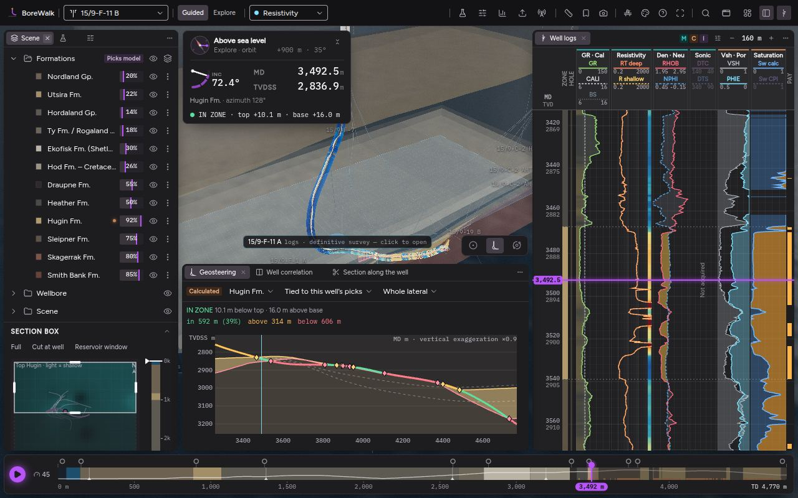
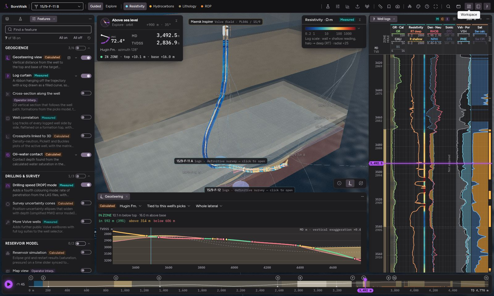
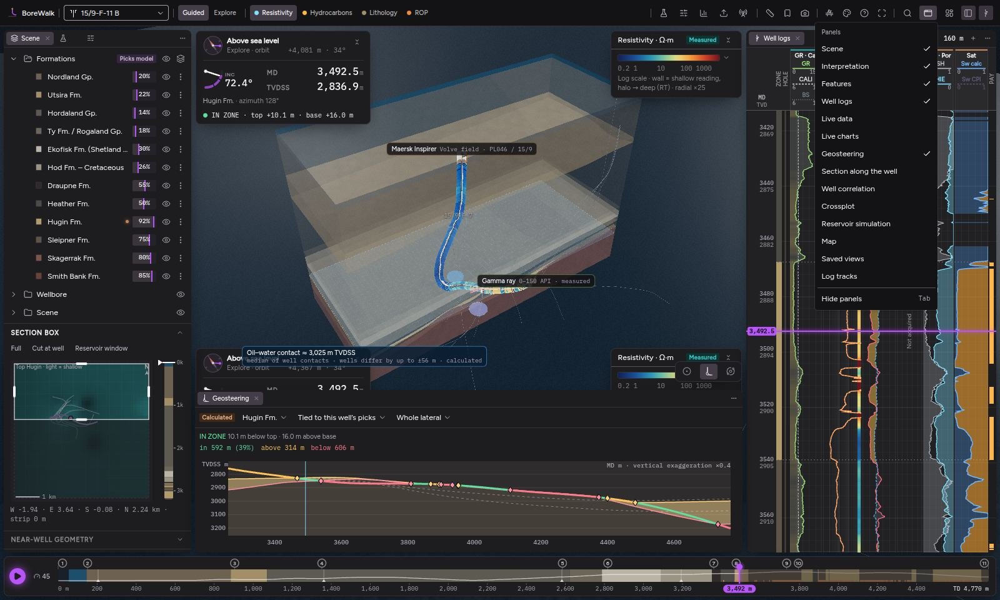

# BoreWalk usability research and proposal

**Status:** proposal for review. It changes no code. Each change listed in section 6 becomes its own PR, stacked on this branch.

**Goal:** make BoreWalk easy to find your way around, while keeping what already works:

- the flexible panel layout: docking, splitting, floating and saved workspaces
- the bottom depth scroller (the timeline)
- the command palette and the action registry, which the command palette and any future AI assistant both use

---

## 1. Summary

BoreWalk does not have too *many* features. The problem is that every feature looks equally important and can be reached from several places, none of which explains itself.

- The top bar has **25 controls**. At 1440 px, 17 of them show as bare icons.
- The **Features** panel is a list of 18 feature switches. That list mixes analysis windows, 3D overlays, graphics settings and tools.
- The same panel can be opened from up to four places.
- Four information cards float over the 3D view, which leaves little of it visible.

The apps we studied share one idea that BoreWalk lacks: **each kind of thing has exactly one home, and the context (what is selected, which task you are doing) decides what is shown.**

| Kind of thing | Home in Figma / Blender / VS Code / Leapfrog / ArcGIS | Home in BoreWalk today | Proposed home |
| --- | --- | --- | --- |
| Objects (wells, formations, contacts, overlays) | Layers / Outliner / project tree | Scene tree, plus Features switches, plus layer presets | **Scene tree** (overlays join it) |
| Settings of the selected object | Properties panel that follows the selection | Row ⋮ menus, a floating Inspector card | **Properties**, shown under the tree |
| Analysis views (crossplot, map, correlation…) | Editor types / views / panes | Features switch first, then a tool window | **Views**, opened directly; the Features switch goes away |
| Actions on the view (measure, snapshot…) | Figma's bottom toolbar, Onshape's view toolbar | Unlabelled icons in the top bar | **Viewport toolbar** |
| App preferences (graphics, theme) | Settings | Features panel plus the Personalise dialog | **Settings** |
| Task layouts | Blender workspace tabs | An icon-only *Workspace* menu | **Workspace tabs** in the top bar |
| "Where is X?" | ⌘K / F3 / Alt+Q / Discover | ⌘K, which only searches titles | **⌘K** that also finds panels and shows where each one is |

Section 5 lists the proposals. In short:

1. Workspaces become visible tabs.
2. A panel rail lists every panel in one place.
3. The Features panel is split up and each item moves to its proper home.
4. A viewport toolbar holds the view tools.
5. A Properties panel follows the selection.
6. A contextual task bar and right-click menus offer the next step for the selected object.
7. Linked views make visible which well and depth each view follows.
8. ⌘K becomes a "where is it" search.

**The bottom scroller stays.** It gets more useful by becoming the master depth cursor and showing the position readout.

---

## 2. What makes it feel complex today

I found these by running the app (`pnpm dev`, 1280–1600 px wide) and reading `src/ui/`.



*The current layout at 1280 × 800. Both columns are open, Geosteering is in the bottom column and four overlay cards sit on the 3D view. What remains of the view is about 560 × 380 px.*

### D1. The top bar mixes six kinds of things, mostly as icons

`TopBar.tsx` puts the following in one row, in this order:

- the well picker
- Guided / Explore
- five colour-by tabs
- Interpretation and Features (panels)
- Production and Data (dialogs)
- Live
- the feature tools: Measure, Saved views, Snapshot
- Field overview, Personalise, Help, Fullscreen
- the palette
- Window and Workspace (menus)
- the left-column toggle and the logs toggle

The overflow logic hides labels before it hides items. At normal desktop widths the right half of the bar is therefore **17 unlabelled icons**, and you have to hover over each one to learn what it does (see the screenshot above). Blender, Figma and VS Code keep their top bars short and put per-view tools next to the view.

### D2. "Features" is a list of switches, not a way to find tools

`features/registry.ts` has 18 switches in 5 groups. They are really five different kinds of thing:

| Kind | Switches |
| --- | --- |
| Analysis windows | Geosteering, Section, Correlation, Crossplot, Map, Simulation |
| 3D overlays | Curtain, Oil–water contact, Uncertainty cones |
| Data | More Volve wells, ROP colour mode |
| Graphics quality | Textures, Shadows, Tunnel FX, Sea FX |
| Tools | Measure, Saved views, Snapshot |

To see a crossplot, you first have to know it is a *feature* called "Crossplots linked to 3D", switch it on in a panel whose tab is only an icon, and then find where its window opened.



### D3. Many ways into the same thing, and none of them explains itself

- **Well logs:** top-bar icon, right-column toggle, Window menu, palette, or its own tab.
- **Interpretation:** top-bar button, icon tab, Window menu, or palette.
- **Visibility:** Scene tree eye icons, Features switches, layer presets, or the Tab key (which hides panels).

Having several ways in is fine when there is also one obvious way. Here there isn't one, so users don't build a picture of where things live. VS Code's guideline is 3–5 views per sidebar, and "don't add content to the Sidebar that could be a simple Command."

### D4. Tabs and folded columns show icons only

- Inactive tabs in a group (Scene / Interpretation / Features) show only their icon.
- A folded column becomes a strip of small icons with no labels.
- The Window menu is the only complete list of panels. It sits behind an icon, and it mixes built-in panels with feature windows.



### D5. The 3D view is crowded with cards

Four cards float over the free area:

- position (`Hud`)
- legend or inspector
- the chapter card (`Narrative`)
- camera (`ViewControls`)

Scene labels are drawn in the same area. Figma tried floating chrome in the UI3 beta and reverted it before release, because it "slowed people down" in an app where the canvas is constantly panned.

### D6. Selecting something doesn't lead anywhere

- Clicking a formation or pick fills a floating Inspector card (`app.inspector`). The tree doesn't highlight the object, and no panel shows its settings.
- Per-object actions sit in each row's ⋮ menu in the Scene tree.
- Every reference app works the other way: select something in the tree or the view, and its properties and actions appear in a fixed place (Figma, ParaView, ResInsight, Leapfrog), or next to it (Adobe's contextual task bar).

### D7. Workspaces are hard to find and have no effect beyond the layout

- Walkthrough / Petrophysics / Geosteering sit in an icon-only menu.
- A preset only rearranges panels. It doesn't set the colouring, the navigation mode or which tools are relevant.
- Changes you make to a preset's layout are lost when you switch to another workspace.

### D8. The first run is dense

The Walkthrough default opens:

- three tabs on the left
- Well logs on the right
- Geosteering in the bottom column, because the `geosteer` feature defaults to on and its window opens on the first well
- four overlay cards
- the timeline

A new user meets almost everything at once.

---

## 3. What the reference apps do well

The sources are listed at the end.

- **Read in full:** the VS Code and ParaView docs (from their GitHub repositories), the Blender manual (from a mirror of the official manual) and the ResInsight user docs (from the repository that builds resinsight.org).
- **Search-result excerpts only:** Figma, Onshape, ArcGIS Pro, Leapfrog, Petrel and Adobe, because the network proxy blocked their sites. Treat exact labels and shortcuts for these as medium confidence.

### Figma (UI3, 2024): canvas first, contextual sidebars

- **Structure:** a left sidebar (File: pages + layers; Assets), a right **properties panel that follows the selection**, a slim **floating toolbar at the bottom centre**, and **Minimize UI** (`Shift+\`).
- **Lesson from the UI3 beta:** floating panels over the canvas were rejected. Users reported visual noise and content moving behind the panels, and the panels slowed people down. UI3 shipped with fixed but resizable panels, and panels float only in Minimize UI mode.
- **Other findability aids:** optional labels for icon controls ("Additional labels"), and one Actions menu (⌘K) that covers commands, assets and plugins.
- **What BoreWalk takes:** docked panels by default, with floating available but not the default. A bottom-centre toolbar for view tools. Properties that follow the selection. Optional labels.

### Visual Studio Code: predictable regions

- **Structure:** Activity Bar → Primary Side Bar → editor → Secondary Side Bar → Panel → Status Bar. Activity Bar icons are *view containers*.
- **Customizing the layout:**
  - Views can be dragged anywhere. **View: Move View** does the same from the keyboard.
  - **Reset Location** works per view, and **Reset View Locations** resets them all.
  - The **Customize Layout** menu toggles each region.
- **Finding a view:** **View: Open View** finds any view by name. `?` in Quick Open lists the available modes.
- **Status bar:** global items on the left, items for the current context on the right.
- **Contexts:** when-clause contexts decide which commands, menus and views apply right now.
- **Empty states:** "welcome views" give an empty view one primary action.
- **What BoreWalk takes:**
  - a single rail that lists every panel
  - "Open panel" in ⌘K, showing where each panel currently is
  - Reset at the panel, workspace and all-workspaces levels
  - `appliesTo` / `when` metadata on actions
  - empty states with one action

### Blender: task workspaces, editor-type switcher

- **Workspace tabs:** workspaces are tabs across the top (Layout, Modeling, Shading, Animation…), switched with `Ctrl PgUp/PgDn`. A workspace can also set a *mode* and *filter add-ons* when you enter it.
- **The default Layout workspace has four editors:** 3D Viewport, Outliner, Properties and **Timeline at the bottom**. That is almost exactly BoreWalk's ideal first screen.
- **Editor-type switcher:** every area has a dropdown that turns it into any editor.
- **Properties editor:**
  - tabs that don't apply to the selected object are hidden
  - `Ctrl F` filters properties across all tabs
  - **Pin** locks the editor to one object
- **Menu Search (F3):** shows the menu path of every result, so each search also teaches where the command lives.
- **Quick Favorites (Q):** a personal popup of commands.
- **What BoreWalk takes:**
  - workspace tabs that set a task context
  - a "+ Add view" switcher in each group header
  - properties filtered by the selection, with a filter field and Pin
  - menu paths in ⌘K

### Onshape: tools that change with the context

- **Structure:**
  - document tabs along the bottom
  - the feature list, and the toolbar across the top, change with the tab type (Part Studio or Assembly)
  - panel icons on the right edge **appear only when they apply**; Display states, for example, appears only in assemblies
- **Search tools** (`Alt+C`) finds and runs any tool.
- **Rollback bar:** a scrubbable position in the feature history.
- **What BoreWalk takes:**
  - rail entries that appear only when the data or the context allows. For example, Uncertainty appears only when the well has a survey error model, and Live only when a source is configured.
  - the timeline as BoreWalk's version of the rollback bar: the one position every view follows

### ArcGIS Pro: linked views, contextual tabs, command search

- **Contextual tabs:** selecting a feature layer adds a *contextual ribbon tab*, highlighted, that holds only the tools for that selection.
- **Command Search (`Alt+Q`):**
  - finds commands, tools *and help topics*
  - before you type, shows recent and frequently used commands
- **Reset Panes for Mapping / Editing / Geoprocessing:** restores a known layout for that kind of work.
- **Linked views:** maps and scenes can follow each other (Center, or Center and Scale). **Selection is always shared** between views, charts and tables, even when navigation isn't linked.
- **Tasks pane:** authored, step-by-step guided workflows that you can leave at any point.
- **What BoreWalk takes:**
  - a contextual task bar for the selected object
  - recent and frequent commands, and help, in ⌘K
  - reset per workspace
  - a shared selection, with depth linking you can switch off per view
  - later, optional guided tasks

### ParaView: synchronised views and selections

- **Structure:** the Pipeline Browser (a tree with eye icons) above a single **Properties** panel. An **advanced ⚙ toggle** reveals expert settings, and the property **search box finds a setting whether or not it's hidden**.
- **Linked selection:** selecting in any view highlights the same data in every view, the spreadsheet included.
- **Find Data:** a query-based selection, such as "porosity > 0.2".
- **Link Manager:** links cameras and properties, and right-clicking a view offers Link Camera.
- **Time Manager:** one panel for the current time, its stride and playback.
- **What BoreWalk takes:**
  - one Properties panel with basic and advanced settings and a search box
  - "Find intervals" (for example GR > 100 and PHIE > 0.15), shown as a selection drawn in 3D, on the logs and as ticks on the timeline
  - the timeline as the Time Manager: MD, window and speed together

### Seequent Leapfrog Geo: the project tree is where you act

- **Project tree:**
  - every data type has a fixed folder
  - **right-click on a folder or object is how you find actions** (import, create, view)
  - you drag from the tree into the scene
- **Shape list:** a separate list of what is currently shown in the scene, with properties for the selected shape. **Go to Project Tree** jumps back to the source item.
- **Slicer:** one moving plane. Each object decides how it reacts to it.
- **Saved Scenes:** kept separate from the layout.
- **What BoreWalk takes:**
  - right-click on wells, formations and overlays, in the tree *and* in 3D, as the main list of actions. Each one opens a view already set up for that object.
  - 3D overlays as tree items with properties
  - saved views ("scenes") kept separate from workspaces (layouts)

### Domain peers (for context)

- **ResInsight**
  - Project Tree plus Property Editor.
  - **Linked Views** appear as a node in the tree, with per-link toggles: camera, cursor, time step, colour result, legend. A link can be paused, and any view can be set as the master.
  - A **depth marker line** follows the cursor across all tracks.
  - F1 on any tree item opens help for that item.
- **Petrel**
  - Explorer panes (Input / Models / **Processes in workflow order** / **Windows** list of every open window).
  - The ribbon adds tabs for the selected object type.
  - **Petrel Guru** gives guidance inside the app.
- **Spotfire**
  - **Marking:** a shared selection, with "fade unmarked" and Details-on-Demand.

---

## 4. Principles for BoreWalk

1. **The 3D view and the timeline are the product.** Panels and cards are there to support them. Nothing floats over the view unless it belongs to the view.
2. **One home for each kind of thing** (the table in section 1). Shortcuts can stay, but every feature has one place you would look first.
3. **Selection drives what you see.** What is selected decides the Properties, the right-click menu and the task bar.
4. **Workspaces set the context for a task**, not only the panel layout.
5. **Show labels on anything used less than daily.** Icons alone are fine only for everyday controls.
6. **Keep the flexibility, but make it optional and undoable.** Docking, splitting, floating and folding stay exactly as they are. The defaults become calmer, and Reset is never more than one click away.

---

## 5. Proposed changes

### Target layout (Walkthrough, first run)

```
┌──────────────────────────────────────────────────────────────────────────────────────────┐
│ BoreWalk │ 15/9-F-11 B ▾ │ Walkthrough │ Petrophysics │ Geosteering │ + │ Search ⌘K │ ? ⚙│
├────────┬─────────────────────┬─────────────────────────────────────────┬─────────────────┤
│ ▤      │ SCENE               │ Resistivity ▾ ▬▬▬▬▬▬ (key = control)    │ WELL LOGS       │
│ Scene  │ ▸ Formations     ◉  │                                         │                 │
│ ⚗      │ ▸ Wells          ◉  │                                         │                 │
│ Interp │ ▸ Overlays       ◉  │               3D view                   │                 │
│ ▦      ├─────────────────────┤                                         │                 │
│ Views  │ PROPERTIES · Hugin  │     Hugin Fm. ─────────────────────┐    │                 │
│ ⇪      │ colour ■  opac. 92% │     │ Isolate · Crossplot zone ·   │    │                 │
│ Data   │ top 3,091 m · 72 m  │     │ Geosteer target   (task bar) │    │                 │
│        │ ⚙ Advanced          │     └──────────────────────────────┘    │                 │
│ ⚙      │                     │ [Guided ◎ ⌖ ⟲│Explore│Measure ✂ Snap ⌂] │                 │
├────────┴─────────────────────┴─────────────────────────────────────────┴─────────────────┤
│ ▶ 45 │ MD 3,492.5 · TVDSS 2,836.9 · 72° · Hugin · IN ZONE │▓ formations · pay · chapter ▓│
└──────────────────────────────────────────────────────────────────────────────────────────┘
 rail     left column           free area (toolbar at bottom centre)            right column
```

**What's different from today:**

- The top bar shrinks from 25 controls to about 9.
- The left rail lists every panel, with labels.
- The Features tab is gone.
- Properties sit under the tree.
- The colour-by control lives in the colour key.
- The view tools sit on one toolbar.
- The position readout joins the timeline.
- Nothing opens in the bottom column on first run.
- Docking, splitting and floating all still work.

### P1. Workspaces become tabs that set a task context (Blender, Onshape, ArcGIS)

- **Tabs:** show *Walkthrough · Petrophysics · Geosteering · your own · +* as tabs next to the well picker. They replace the icon-only Workspace menu. `Ctrl PgUp/PgDn` switches between them.
- **Each workspace keeps its own live layout,** as in Blender. Rearranging panels in Geosteering changes Geosteering only, and switching away and back keeps the change.
- **Tab right-click menu:** *Reset "Geosteering"*, *Duplicate*, *Rename*, *Delete*. Built-in workspaces can be reset but not deleted.
- **A workspace can also set a context:**
  - the colour-by mode (Petrophysics → Hydrocarbons)
  - the navigation mode (Geosteering → Guided / chase)
  - which views the rail suggests (like Blender's add-on filter). Views that aren't suggested stay available through the rail's "All" list and ⌘K.
- **Code:**
  - `ui/workspace/layout.ts`: `Workspace` stores `layouts: Record<workspaceId, Layout>` in place of the single `layout` plus immutable `PRESETS`. A preset becomes the *reset target*.
  - `ui/workspace/menus.tsx`: the menu becomes the tab context menu.
  - `ui/shell/TopBar.tsx`
  - A `v: 2` migration keeps the saved layouts in `bw.workspaces.v2`.
- **Effort:** S–M.

### P2. A panel rail: one labelled list of every panel (VS Code, Petrel's Windows pane, Onshape)

- **The rail:** a narrow, always-present rail on the far left, with icon *and* short label. It is grouped:
  - **Scene**
  - **Interpretation**
  - **Views** (a flyout listing every analysis view, grouped by workflow phase: *Explore* Map, Section · *Interpret* Correlation, Crossplot · *Steer* Geosteering · *Model* Simulation · *Monitor* Live charts)
  - **Data** (Import, Production, Live sources)
  - **Settings**, at the bottom
- **Clicking an entry reveals the panel wherever it is docked:**
  - if its column is folded, the column unfolds
  - if it's a background tab, the tab comes to the front
  - if it's closed, it opens where it was last, as `Workspace.open` already does
- **Entry states:** a filled dot means the panel is showing, a hollow dot means it's open but hidden, and a greyed entry means there's no data for it on this well (Onshape's conditional icons).
- **Entry right-click menu:** *Dock left / right / bottom · Float · Reset location · Close*. This is VS Code's Move View and Reset Location.
- **What the rail replaces:**
  - the Window menu
  - the Interpretation, Features, Logs, Live and left-column buttons in the top bar
- **Folded left column:** its icon strip merges into the rail, so there are never two icon strips side by side.
- **Group headers:** get a **"+" (Add view)** menu, as in Blender's editor-type switcher and ParaView's empty frame. The chosen view opens *in that group*, without any dragging.
- **Tab labels:** tabs always show their label and switch to icon-only only when they run out of room.
- **Code:**
  - `ui/workspace/Frame.tsx` (the rail, the folded-strip merge, labelled tabs, "+")
  - `ui/workspace/panels.tsx` (a `group` and `available()` for each panel)
  - `ui/shell/TopBar.tsx`
- **Effort:** M.

### P3. Split up the Features panel and move each item to its home (Leapfrog, Figma)

The feature flags stay as the internal mechanism (`FeatureFlags`, `?features=`). What changes is how you find and use each item:

| Feature | New home | How you use it |
| --- | --- | --- |
| Geosteering, Section, Correlation, Crossplot, Map, Simulation | **Views** (rail, "+", ⌘K, right-click) | Opening the view switches the feature on. Closing its last window switches it off, so it stops computing. |
| Log curtain, Oil–water contact, Uncertainty cones, geosteering band in 3D | **Scene › Overlays** folder | An eye icon to show or hide it. Its settings (curve, σ…) move to **Properties**, from `FeatureModule.settings()`. |
| ROP colour mode | **Colour-by** list | Shown whenever the well has ROP. It no longer needs a switch. |
| More Volve wells | Well picker footer: *Show more Volve wells* | |
| Textures, Shadows, Tunnel FX, Sea FX | **Settings › Graphics** | A *Quality: Low / Medium / High* preset (Low = today's `?q=low`), with the four switches under "Custom". |
| Measure, Saved views, Snapshot | **Viewport toolbar** (P4) | |

- **Code:**
  - Add `home: 'view' | 'overlay' | 'colour' | 'wells' | 'graphics' | 'tool'` to each entry in `features/registry.ts`.
  - Remove `ui/shell/FeaturesPanel.tsx`.
  - `ui/shell/ScenePanel.tsx` gets an Overlays folder.
  - `ui/shell/PersonaliseDialog.tsx` becomes Settings, with a Graphics section.
  - The palette's `feature.*` action is aimed at the new homes.
- **Effort:** M–L. This does the most to reduce the "hard to find" feeling.

### P4. A viewport toolbar, and fewer cards over the 3D view (Figma UI3, Onshape)

- **One floating toolbar** at the bottom centre of the free area, just above the timeline:
  - **Guided** (Inside · Chase · Orbit) **| Explore** (Fly · Orbit). This merges the top-bar Guided/Explore tabs with `ViewControls`.
  - **Measure (M)**, **Section box**, **Snapshot**, **Saved views**, **Field overview**
  - Tooltips show the shortcuts.
- **The colour key becomes the colour-by control** ("Resistivity ▾"). The five colour tabs leave the top bar. The key already chooses the resistivity colour map, so choosing the property there is the obvious next step. `V` still cycles the property.
- **The position readout (MD · TVDSS · INC · zone · in-zone) moves into the left end of the timeline,** next to Play and speed. The larger `Hud` card becomes an optional "Details" popover. This makes the timeline richer without changing how it works.
- **The chapter card is anchored to the timeline's chapter markers.** It shows while the tour plays or when you click a marker, and is otherwise just the numbered markers already on the strip.
- **The Inspector card** moves into Properties (P5).
- **What stays over the 3D view:** the colour key and the toolbar, both part of the view, like Figma's canvas controls.
- **Code:** `ViewControls.tsx`, `Legend.tsx`, `Hud.tsx`, `Narrative.tsx`, `Timeline.tsx`, `Workspace.tsx` (`Overlays`) and `TopBar.tsx`.
- **Effort:** M.

### P5. Selection drives the Properties panel (Figma, ParaView, ResInsight, Blender)

- **A shared selection:** `app.selection`, a signal of `{ kind: 'well' | 'formation' | 'pick' | 'contact' | 'overlay' | 'interval', id }`, replaces the display-only `app.inspector`.
  - Clicking in 3D, the tree, the logs, the correlation or the crossplot sets it.
  - The tree highlights the selected row, and 3D outlines the selected object.
- **Properties:** a section under the Scene tree (or a panel of its own, dockable like the others) shows the selected object's details (today's `inspect.tsx` rows) and its settings: colour, opacity, isolate, curve, σ. With nothing selected it shows the scene display settings.
- **Pin (📌):** keeps Properties on one object, for comparing wells.
- **Advanced ⚙ and a filter field** (ParaView). This applies to Interpretation too:
  - *Basic*: model, cut-offs, summary.
  - *Advanced*: Rw, a, m, n, Rsh, reference temperature.
  - The filter finds a setting in both sections.
- **Right-click menus in the tree and in 3D replace the row ⋮ menus,** as in Leapfrog and ResInsight. Their items come from the action registry: each action gets `appliesTo: SelectionKind[]`, like a VS Code when-clause. The palette, the context menu and the task bar then list the same verbs, and TanStack AI tool descriptions stay correct.
- **Code:** `ui/app.ts`, `ui/inspect.tsx`, `ui/shell/Inspector.tsx` → `PropertiesPanel.tsx`, `ScenePanel.tsx`, `actions/registry.ts`, `actions/appActions.tsx`.
- **Effort:** L. It is the foundation for P6.

### P6. The next step, shown next to the selected object (Adobe contextual task bar, ArcGIS contextual tabs)

- **A contextual task bar** appears near the selection in 3D and offers 3–4 likely next steps. The items come from `appliesTo` actions:
  - **Well:** *Show logs · Correlate · Section along well · Geosteer*
  - **Formation:** *Isolate · Flatten correlation on top · Crossplot this zone · Set as geosteer target*
  - **Interval from the crossplot brush:** *Show in logs · Fly to · Clear*
- **It opens the view already set up for that object.** This is how the ~10 analysis windows become one click away from what they analyse, instead of sitting in a list.
- **The bar hides** during camera motion and while the tour plays. A Settings option turns it off.
- **Effort:** S–M once P5 is done.

### P7. Linked views you can see (ParaView, ArcGIS, ResInsight, Spotfire)

Some of this already exists: the crossplot brush marks samples in 3D, and the logs, geosteering and section follow the depth cursor. P7 makes it consistent and visible.

- **Shared channels:**

  | Channel | Default link |
  | --- | --- |
  | active well | on |
  | cursor MD (the timeline is the master) | on |
  | hover MD, echoed as a marker in every view | on |
  | marking: brushed or queried intervals | on |
  | selected formation | on |

- **A link chip in each view header,** for example "⛓ F-11 B · cursor", opens toggles for each channel and a **Pin to this well** option. Two correlation or log views can then compare wells, where today every view follows the active well.
- **The timeline shows marking ticks** (brushed intervals, *Find intervals* results) next to the formations, pay and chapter markers, so scrubbing jumps between them. The timeline becomes the one control every view follows, like Onshape's rollback bar and ParaView's Time Manager, and it stays the scroller you like.
- **Effort:** M.

### P8. ⌘K answers "where is it?" (VS Code, Blender F3, ArcGIS Alt+Q, Photoshop Discover)

- **Match descriptions too.** Today the palette matches only titles, keywords and categories (`CommandPalette.tsx`), so a search for "porosity" doesn't find the crossplot.
- **Before you type:** show **recent** and **frequently used** commands.
- **Open panel mode:** `>panel` lists every panel with its **current location** ("Crossplot: bottom column, tab 2", "hidden") and reveals the one you pick.
- **A breadcrumb on each result** shows where the command lives in the interface ("Scene › Section box"), so the palette teaches the layout.
- **`?` lists the modes.** Help topics ("Controls & data notes") appear as results too.
- **Effort:** S–M.

### P9. Undo for layout changes, and empty states (VS Code, Photoshop, ArcGIS)

- **Reset at three levels:**
  - *Reset location* on each panel (P2)
  - *Reset workspace* (P1)
  - *Reset all workspaces* in Settings
- **Maximise a panel** with `Ctrl Space` or a double-click on its tab (Blender). The timeline stays visible. **Minimise UI** is the existing Tab key; add it to the rail tooltip.
- **Empty states:** a view that has no data for this well says so and offers one action. For example: *"Crossplot needs RHOB and NPHI. 15/9-F-11 A has them → Switch well"*, or *"Simulation needs the Eclipse files → Import"*.
- **Effort:** S.

### P10. Simpler docking: fixed regions, explicit undock (decided with the owner)

Free docking turned out to be part of the complexity. Every placement option is one more thing to learn and get wrong. The flexibility the owner values is *different layouts for different tasks*, and workspaces (P1) provide that. So:

- **Regions:**
  - **Three fixed regions:** left sidebar, right sidebar and bottom panel. Each can be resized and collapsed, and each holds tabs.
  - The 3D view and the timeline are always present.
  - Nothing can create a new column or region.
- **One fixed split per sidebar:**
  - Each sidebar has a top slot and a bottom slot, divided by a draggable divider (Blender's Outliner above Properties).
  - The bottom slot is hidden while it's empty.
  - Default: Scene / Interpretation above Properties on the left.
  - Nothing can create further splits.
- **Floating windows:**
  - Only an **Undock ↗** button creates one, from the tab header or tab menu.
  - Drag a floating window by its header to move it, and by its edges to resize it. Dragging never docks it.
  - **Dock back ↙**, or a double-click on the header, returns it to the exact slot and tab it came from.
  - Several can be open at once. Each remembers its own size and position, and Tab hides them with everything else.
- **Moving between regions** uses the tab menu and the rail (*Move to left / right / bottom*), not drop targets. Dragging a tab only reorders it within its group.
- **Undo:**
  - Every layout change shows a toast with **Undo**.
  - *Reset location* and *Reset workspace* (P1, P2) cover larger mistakes.
- **Migration:**
  - Saved layouts with extra splits merge those groups into the nearest slot, as tabs.
  - Floating windows stay floating and get a remembered home.
- **Code:** `ui/workspace/Frame.tsx` (the drop-target logic in `createDnd` shrinks to reordering within a group) and `ui/workspace/layout.ts` (a column becomes `{ top, bottom? }` slots; the `split` / `zone` drop targets go away).
- **Effort:** M. It comes after P2.

### Later, and optional

- **Guided tasks** (ArcGIS Tasks, Petrel Guru): a workspace can carry a short checklist ("1. Pick the landing zone 2. Check the crossplot…"). Each step applies the view it needs.
- **Find intervals** (ParaView Find Data): a query panel whose matches become the shared marking.
- **Quick Favorites (`Q`)** (Blender): right-click any command → *Add to favourites*.

### Explicitly not proposed

- **Moving the analysis views into a split main area (ParaView layouts).** It conflicts with "the 3D view never resizes", which the current design deliberately guarantees. The dock system already gives the flexibility you like.
- **A ribbon (ArcGIS, Petrel).** It adds density, and the rail plus the contextual task bar give the same context-driven benefit without it.
- **Removing floating windows.** They stay, but only as an explicit Undock / Dock back (P10), never as the result of a missed drop.

---

## 6. Rollout as stacked PRs

Each PR builds on the one before it (the base is this branch). Each can be shipped and reverted on its own.

| # | Branch (suggested) | Contains | Depends on | Size |
| --- | --- | --- | --- | --- |
| 1 | `ux/1-workspace-tabs` | P1 workspace tabs, per-workspace layouts, reset, migration | — | S–M |
| 2 | `ux/2-panel-rail` | P2 rail, labelled tabs, "+ Add view", reset location; removes the Window menu and top-bar panel buttons | 1 | M |
| 3 | `ux/3-features-rehome` | P3 views open directly, Overlays folder, Settings › Graphics, colour-by ROP, well-picker footer; removes FeaturesPanel | 2 | M–L |
| 4 | `ux/4-viewport-toolbar` | P4 toolbar, colour key as control, readout in the timeline, chapter card on markers | 3 | M |
| 5 | `ux/5-selection-properties` | P5 `app.selection`, Properties with pin, advanced and filter, right-click menus, `appliesTo` on actions | 4 | L |
| 6 | `ux/6-task-bar-links` | P6 contextual task bar, P7 link chips, marking ticks on the timeline | 5 | M |
| 7 | `ux/7-palette-empty-states` | P8 palette upgrades, P9 maximise and empty states | 2 | S–M |

After PR 4 the top bar holds:

- brand
- well picker
- workspace tabs
- search
- help
- settings
- a More (⋯) menu with Fullscreen

That is about 9 controls, down from 25.

### How we'll know it worked

Time five short tasks before and after, with 2–3 people who haven't used BoreWalk. Record the clicks and whether they had to hover to find a control.

| Task | Today |
| --- | --- |
| Open a density–neutron crossplot for 15/9-F-11 A | Switch well → icon-only Features tab → find "Crossplots linked to 3D" → turn it on → find the window (≥ 5 steps) |
| Hide the Draupne formation, then show only the reservoir | Eye icon in the Scene tree, then the unlabelled layers icon on the Formations row → *Reservoir focus* |
| Change the net-pay porosity cut-off | Icon-only Interpretation tab → scroll to Net pay cut-offs (3 steps) |
| Colour the well by lithology and find what the colours mean | Top-bar tab, then the legend card (2 places) |
| Set up your own layout, then get the default back | Drag the panels, then the icon-only Workspace menu → Reset to default, which always goes back to Walkthrough, whichever workspace you were in |

**Targets:**

- every task takes 3 steps or fewer
- nobody needs to hover to identify a control
- nobody asks "where is…?" for anything on the rail

---

## 7. Decisions for you

1. **Colour-by out of the top bar** and into the colour key (P4): is that acceptable? It is the biggest visual change to the top bar. The alternative is to keep it as a single "Colour: Resistivity ▾" control in the top bar.
2. **Workspace edits save automatically into the workspace** (Blender), with Reset as the undo. The other option is that presets stay fixed and you choose "Save as" explicitly (Illustrator). I recommend automatic saving.
3. **Where Properties goes:** under the Scene tree, the ParaView / ResInsight style that I recommend, or a separate panel on the right, the Figma style.
4. **Where to start:** PR 1 → 2 → 3 gives the biggest findability gain for the effort. PR 5 is the largest piece and unlocks P6 and P7.

---

## Sources

**Read in full**

- VS Code docs:
  - [custom layout](https://raw.githubusercontent.com/microsoft/vscode-docs/main/docs/configure/custom-layout.md)
  - [user interface](https://raw.githubusercontent.com/microsoft/vscode-docs/main/docs/editing/getting-started/userinterface.md)
  - UX guidelines: [overview](https://raw.githubusercontent.com/microsoft/vscode-docs/main/api/ux-guidelines/overview.md), [views](https://raw.githubusercontent.com/microsoft/vscode-docs/main/api/ux-guidelines/views.md), [sidebars](https://raw.githubusercontent.com/microsoft/vscode-docs/main/api/ux-guidelines/sidebars.md), [panel](https://raw.githubusercontent.com/microsoft/vscode-docs/main/api/ux-guidelines/panel.md), [activity bar](https://raw.githubusercontent.com/microsoft/vscode-docs/main/api/ux-guidelines/activity-bar.md), [status bar](https://raw.githubusercontent.com/microsoft/vscode-docs/main/api/ux-guidelines/status-bar.md)
  - [when-clause contexts](https://raw.githubusercontent.com/microsoft/vscode-docs/main/api/references/when-clause-contexts.md)
- Blender manual, from a mirror of docs.blender.org:
  - [workspaces](https://raw.githubusercontent.com/dfelinto/blender-manual/main/manual/interface/window_system/workspaces.rst)
  - [regions](https://raw.githubusercontent.com/dfelinto/blender-manual/main/manual/interface/window_system/regions.rst)
  - [areas](https://raw.githubusercontent.com/dfelinto/blender-manual/main/manual/interface/window_system/areas.rst)
  - [properties editor](https://raw.githubusercontent.com/dfelinto/blender-manual/main/manual/editors/properties_editor.rst)
  - [menu search](https://raw.githubusercontent.com/dfelinto/blender-manual/main/manual/interface/controls/templates/operator_search.rst)
  - [status bar](https://raw.githubusercontent.com/dfelinto/blender-manual/main/manual/interface/window_system/status_bar.rst)
  - [industry-compatible keymap](https://raw.githubusercontent.com/dfelinto/blender-manual/main/manual/interface/keymap/industry_compatible.rst)
- ParaView release notes: [5.10](https://raw.githubusercontent.com/Kitware/ParaView/master/Documentation/release/ParaView-5.10.0.md), [5.11](https://raw.githubusercontent.com/Kitware/ParaView/master/Documentation/release/ParaView-5.11.0.md), [5.12](https://raw.githubusercontent.com/Kitware/ParaView/master/Documentation/release/ParaView-5.12.0.md), [5.13](https://raw.githubusercontent.com/Kitware/ParaView/master/Documentation/release/ParaView-5.13.0.md), [6.0](https://raw.githubusercontent.com/Kitware/ParaView/master/Documentation/release/ParaView-6.0.0.md)
- ResInsight user docs: [overview](https://raw.githubusercontent.com/OPM/ResInsight-UserDocumentation/gh-pages/getting-started/overview/index.html), [project tree](https://raw.githubusercontent.com/OPM/ResInsight-UserDocumentation/gh-pages/getting-started/projecttree/index.html), [linked views](https://raw.githubusercontent.com/OPM/ResInsight-UserDocumentation/gh-pages/3d-main-window/linkedviews/index.html), [well log plots](https://raw.githubusercontent.com/OPM/ResInsight-UserDocumentation/gh-pages/plot-window/welllogsandplots/index.html), [window management](https://raw.githubusercontent.com/OPM/ResInsight-UserDocumentation/gh-pages/misc/windowmanagement/index.html)

**Search-result excerpts only** (the network proxy blocked direct access)

- Figma:
  - [Our approach to designing UI3](https://www.figma.com/blog/our-approach-to-designing-ui3/)
  - [Behind our redesign](https://www.figma.com/blog/behind-our-redesign-ui3/)
  - [Actions menu](https://help.figma.com/hc/en-us/articles/23570416033943-Use-the-actions-menu-in-Figma-Design)
  - [Floating panels UX lesson](https://bitskingdom.com/blog/figma-floating-panels-ux-lesson/)
- Blender: [2.80 UI release notes](https://developer.blender.org/docs/release_notes/2.80/ui/)
- Onshape: [UI basics](https://cad.onshape.com/help/Content/ui-basics.htm), [search tools](https://cad.onshape.com/help/Content/Home/search_tools.htm), [document tabs](https://cad.onshape.com/help/Content/Document/document_tabs.htm)
- ArcGIS Pro: [Command search](https://pro.arcgis.com/en/pro-app/latest/get-started/find-tools-and-help-command-search.htm), [linked views](https://pro.arcgis.com/en/pro-app/latest/help/mapping/navigation/introduction-to-linked-views.htm), [charts](https://pro.arcgis.com/en/pro-app/latest/help/analysis/geoprocessing/charts/interact-with-a-chart.htm), [tasks](https://pro.arcgis.com/en/pro-app/latest/help/tasks/whatistask.htm)
- Leapfrog Geo: [project tree](https://help.seequent.com/Geo/6.0/en-GB/Content/basics/project-tree.htm), [3D scene](https://help.seequent.com/Geo/5.1/en-GB/Content/basics/scene.htm), [organising the workspace](https://help.seequent.com/Geo/4.4/en-GB/Content/basics/workspace.htm)
- Adobe: [Photoshop contextual task bar](https://helpx.adobe.com/photoshop/using/contextual-task-bar.html), [Illustrator contextual task bar](https://helpx.adobe.com/illustrator/using/contextual-task-bar.html), [Discover panel](https://helpx.adobe.com/photoshop/desktop/get-started/learn-the-basics/access-discover-panel.html)
- Petrel: [Petrel 2014 ribbon](https://oilit.com/HTML_Articles/2014_6_7.php), [Petrel Guru](https://www.software.slb.com/products/petrel/petrel-guru)
- Spotfire: [marking](https://docs.tibco.com/pub/spotfire/6.5.3/doc/html/vis/vis_marking_in_visualizations.htm)
